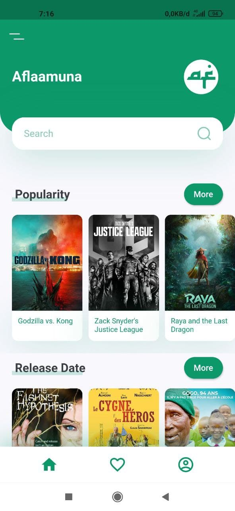
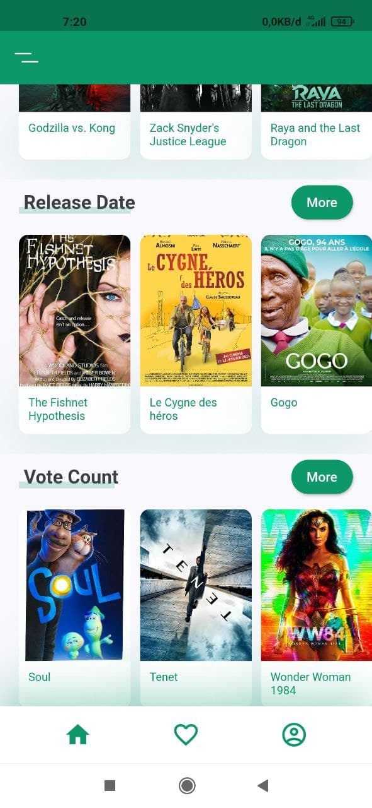
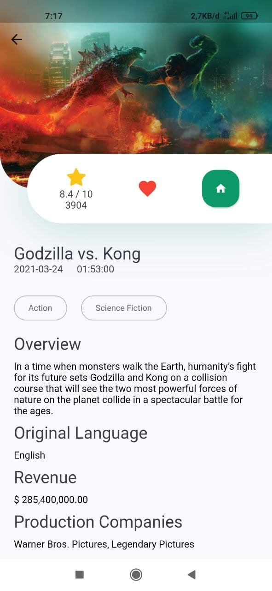

# Aflaamuna (Film Kita)

A movie app build with [Flutter](https://flutter.dev/) & [TMDB Api](https://developers.themoviedb.org/3/getting-started/introduction).

## ToDos
- [ ] redesign UI
- [ ] account detail
- [ ] dark mode support
- [ ] localization
- [ ] search
- [ ] share movie
- [ ] favorite page
- [ ] authentication page
- [x] movie page
- [x] detail page
- [ ] unit testing & integration testing

Hopefully this app gets better soon
## Demo
[Uploading aflaamuna-apk.zip…](Download)

## Flutter version
>Flutter 2.1.0-12.1.pre  
>Tools • Dart 2.13.0

## Preview

### moviepage

</img>
</img>

### detaimoviepage
</img>

## Getting Started

For help getting started with Flutter, view online
[documentation](https://flutter.dev/).

#### 1. [Setup Flutter](https://flutter.dev/docs/get-started/install)

#### 2. Clone the repo

```sh
$ git clone https://github.com/zaenury/aflaamuna.git
$ cd aflaamuna
```

#### 4. Run the app

```sh
$ flutter run
